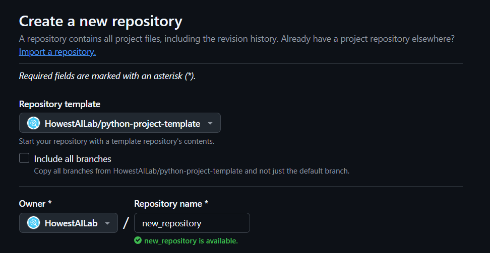
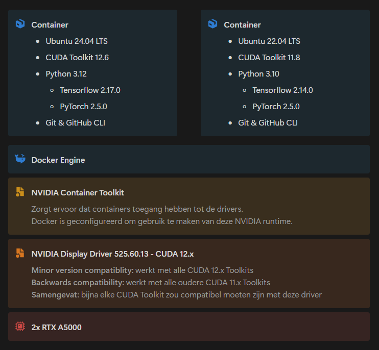

<h3 align="center">Python project template 🐍✨</h3>

_This is an up-to-date **Devcontainer** template for developing **Python** projects._ 
_It has optional support for **TensorFlow** and **PyTorch** on **GPU** enabled machines._

# Instructions

1. Create a new repository using this GitHub template.
2. Clone the repository and open it using VSCode.
3. Run `python .devcontainer/change_gpu_config.py` to select your GPU mode.
4. Press `Ctrl+Shift+P` to open the command palette.
5. Search for `Dev Containers: Rebuild and Reopen in Container`.
6. Follow the instructions in the terminal to install TensorFlow or PyTorch.
7. You are now ready to start developing! 😀

# Devcontainer info

## Base OS

| Name   | Version | Image                                                                                                                  |
| :----- | :------ | :--------------------------------------------------------------------------------------------------------------------- |
| Ubuntu | 24.04   | [mcr.microsoft.com/devcontainers/base:ubuntu-24.04](https://github.com/devcontainers/images/tree/main/src/base-ubuntu) |

## Features

| Name       | Version | Image                                                                                                                                 |
| :--------- | :------ | :------------------------------------------------------------------------------------------------------------------------------------ |
| Python     | 3.12    | [ghcr.io/devcontainers/features/python:1](https://github.com/devcontainers/features/tree/main/src/python)                             |
| Git        | Latest  | [ghcr.io/devcontainers/features/git:1](https://github.com/devcontainers/features/tree/main/src/git)                                   |
| GitHub CLI | Latest  | [ghcr.io/devcontainers/features/github-cli:1](https://github.com/devcontainers/features/tree/main/src/github-cli)                     |
| Docker     | Latest  | [ghcr.io/devcontainers/features/docker-in-docker:1](https://github.com/devcontainers/features/tree/main/src/docker-outside-of-docker) |

## Libraries

| Name       | Version | Description                       | Optional |
| :--------- | :------ | :-------------------------------- | -------- |
| TensorFlow | 2.19.0  | AI development framework          | Yes      |
| PyTorch    | 2.7.0   | AI development framework          | Yes      |
| uv         | Latest  | Extremely fast dependency manager | No       |

## Extensions

| Name            | Description             | ID                              |
| :-------------- | :---------------------- | :------------------------------ |
| Reload          | VSCode reload button    | natqe.reload                    |
| Python          | Python language support | ms-python.python                |
| Pylint          | Static code analyser    | ms-python.vscode-pylint         |
| Black           | Code formatter          | ms-python.black-formatter       |
| Jupyter         | Jupyter extension pack  | ms-toolsai.jupyter              |
| Prettier        | Code formatter          | esbenp.prettier-vscode          |
| Commit Reminder | Commit reminder         | kurozero.vscode-commit-reminder |

# Dependency management

## uv

The **uv** package is an extremely fast Rust-based dependency manager, similar to **Poetry**.
To better understand the differences between **pip**, **uv** and **Poetry**, check out the table below:

| pip                               | poetry                    | uv                    |
| :-------------------------------- | :------------------------ | :-------------------- |
| `pip install <package>`           | `poetry add <package>`    | `uv add <package>`    |
| `pip uninstall <package>`         | `poetry remove <package>` | `uv remove <package>` |
| `pip install -r requirements.txt` | `poetry install`          | `uv sync`             |

## Tensorflow & PyTorch

> [!IMPORTANT]  
> If you use this Devcontainer template, you won't have to run any of the commands below manually. Simply follow the instructions in the terminal after you rebuild your container.

|                | **CPU-only**             | **GPU-accelerated**      |
| :------------- | :----------------------- | :----------------------- |
| **Tensorflow** | `uv sync --extra tf-cpu` | `uv sync --extra tf-gpu` |
| **PyTorch**    | `uv sync --extra pt-cpu` | `uv sync --extra pt-gpu` |

If you simply want to install your regular dependencies (FastAPI, pandas, ...) without Tensorflow or PyTorch, you can use the `uv sync` command without any `--extra` attribute.

# Possible errors

| **❌ Error**                                                | **✅ Solution**                                                                |
| :---------------------------------------------------------- | :----------------------------------------------------------------------------- |
| Shell scripts fail to run or complain about `\r` characters | Check if the `End of Line` formatting of the scripts is set to `LF` in VSCode. |

# Versioning

> [!NOTE]  
> Since PyTorch and Tensorflow - if installed correctly - already include the neccessary CUDA and cuDNN tools, you don't need to install them separately. This section is only to clarify the compatibility between CUDA libraries and the host NVIDIA driver.

| CUDA Toolkit | Linux Driver Version | Windows Driver Version |
| :----------- | :------------------- | :--------------------- |
| CUDA 12.x    | >= 525.60.13         | >= 527.41              |
| CUDA 11.x    | >= 450.80.02         | >= 452.39              |

- The CUDA Toolkits have **minor version compatibility** with the drivers. 
  _This means that CUDA Toolkit 12.6 should work with a driver that's designed for CUDA 12.0 because they have the same major version._
- The CUDA Toolkits are **backwards compatible** with the drivers. 
  _This means that CUDA Toolkit 11.8 will still work with a newer driver that's designed for CUDA 12.x versions._

| Latest version    | Python version | CUDA |
| :---------------- | :------------- | :--- |
| TensorFlow 2.19.0 | 3.9-3.12       | 12.3 |
| PyTorch 2.7.0     | 3.9-3.13       | 12.8 |

The most recent common Python version is **3.12**.

# GPU acceleration

The **hosts NVIDIA driver** gets passed to the container using the **[NVIDIA Container Toolkit](https://docs.nvidia.com/datacenter/cloud-native/container-toolkit/latest/index.html)**.
You can validate your Container Toolkit installation by checking the **Docker daemon** configuration file on your server: `/etc/docker/daemon.json`.
To spin up a GPU-accelerated container, append the `--gpus=all` and `--runtime=nvidia` arguments to your `docker run` command.
Luckily, these arguments are already preconfigured in `devcontainer.json`.

The **NVIDIA driver** on Howest AI Lab's A5000 server has version **12.0**. 

